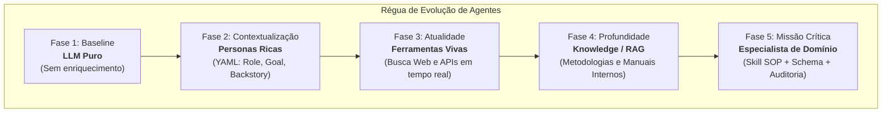
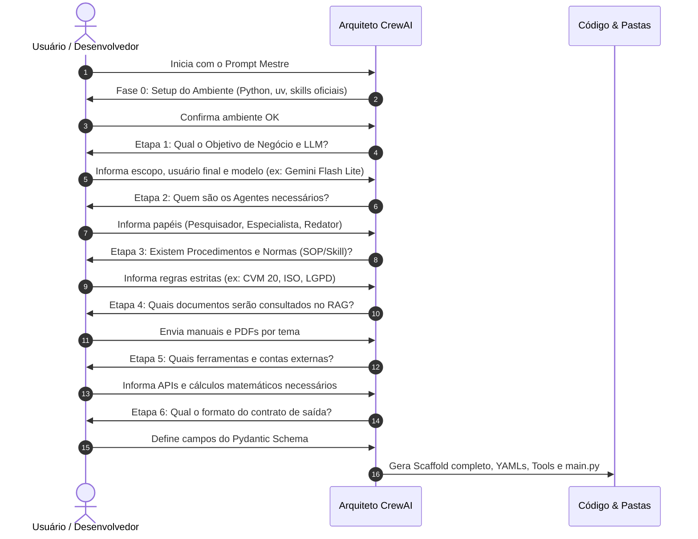
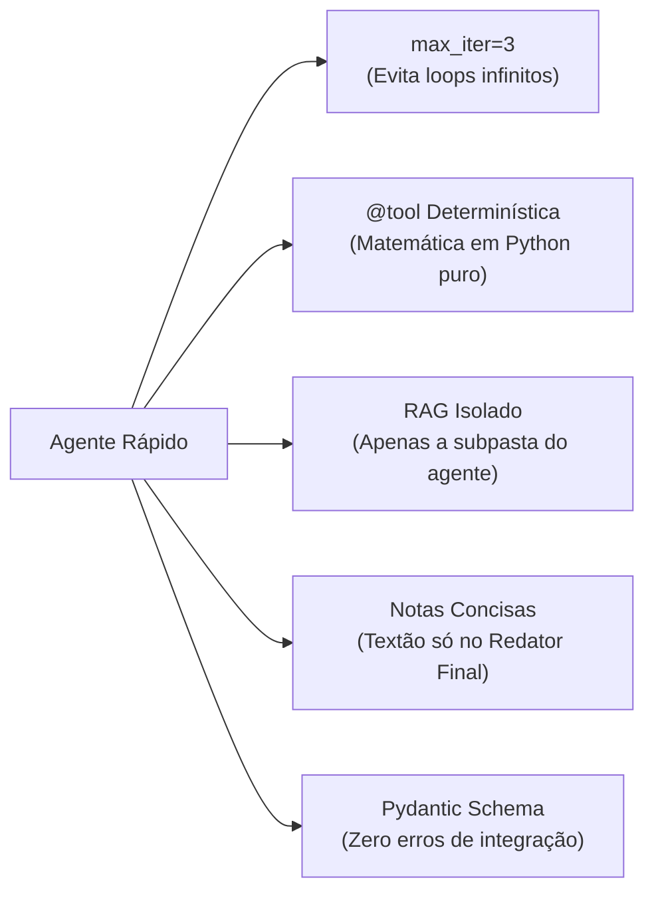

# Guia Definitivo: Metodologia e Criação de Projetos CrewAI Enterprise

Este documento é o manual oficial de referência para projetar, desenvolver e escalar soluções multiagentes utilizando o framework **CrewAI**. Ele reúne o conhecimento consolidado dos testes empíricos, a estrutura modular corporativa e os padrões oficiais recomendados pela equipe do CrewAI.

---

## 1. Visão Geral: As 5 Camadas de Maturidade do CrewAI

Ao projetar uma equipe autônoma, a qualidade da entrega depende da camada de maturidade técnica em que os agentes operam. No nosso piloto, validamos empiricamente as 5 camadas evolutivas:



### Detalhamento das 5 Fases

| Camada / Fase | O Que é Testado | Para Que Serve | O Que se Espera de Resultado |
| :--- | :--- | :--- | :--- |
| **Fase 1: LLM Puro** | Agentes com definições mínimas de 1 linha, sem personas, ferramentas ou documentos. | Estabelecer a **régua zero** (baseline) para avaliar o quanto cada recurso adicional realmente agrega. | Relatório genérico e superficial, baseado unicamente na memória de treinamento estática do modelo. |
| **Fase 2: Persona Elaborada** | Roles, Goals e Backstories ricos carregados declarativamente de arquivos YAML (`config/`). | Moldar o tom executivo, vocabulário especializado, nível de ceticismo e autoridade técnica. | Salto significativo na maturidade do texto, eliminação de linguagem leiga e melhor encadeamento lógico. |
| **Fase 3: Ferramentas Vivas** | Integração de `@tool` de pesquisa em tempo real (`web_search_tool` / APIs). | Superar o limite temporal do LLM e trazer fatos, números e acontecimentos dos últimos dias. | Inserção de dados recentes, citação de fontes verificáveis e drástica redução de alucinações factuais. |
| **Fase 4: Knowledge (RAG)** | Injeção de manuais e frameworks proprietários via busca semântica vetorial. | Fazer o agente aplicar a **metodologia exclusiva da sua empresa** e não um padrão de internet. | Estruturação analítica rigorosa (SWOT, valuation, matrizes de risco) sobre os dados coletados. |
| **Fase 5: Especialista (SOP)** | Procedimento Operacional Padrão (`SKILL.md`), conformidade regulatória e validação Pydantic. | Atuação de nível institucional (ex: Analista CNPI, Jurídico, Médico) com regras estritas de conduta. | Parecer auditável, conformidade com normas (ex: CVM 20), cenários de estresse e zero improviso. |

---

## 2. Estrutura Modular Corporativa do Repositório

Para evitar código confuso e garantir que novos agentes, skills ou documentos sejam adicionados sem quebrar o sistema, todo projeto segue rigorosamente esta árvore:

```text
meu_projeto_crewai/
│
├── .env                              # Chaves de API (GOOGLE_API_KEY, TAVILY_API_KEY, etc.)
├── pyproject.toml / requirements.txt # Gerenciamento de dependências
├── main.py                           # Ponto de entrada de execução (CLI ou API)
├── app.py                            # (Opcional) Interface interativa Streamlit
│
├── config/                           # 🎭 CONFIGURAÇÃO DECLARATIVA
│   ├── agents.yaml                   # Personas: papéis, objetivos e backstories
│   └── tasks.yaml                    # Tarefas: descrição detalhada e output esperado
│
├── skills/                           # 🧠 PROCEDIMENTOS OPERACIONAIS (SOPs)
│   └── <nome_da_skill>/
│       └── SKILL.md                  # Algoritmo de pensamento passo a passo do especialista
│
├── knowledge/                        # 📚 BASES DE RAG (Separadas por TEMA)
│   ├── metodologias/                 # Manuais e metodologias internas
│   ├── regulatorio/                  # Leis, normas, compliance e regimentos
│   └── macroeconomia/                # Guias setoriais e indicadores
│
├── tools/                            # ⚙️ FERRAMENTAS DETERMINÍSTICAS (@tool)
│   ├── search_tools.py               # Ferramentas de busca rápida e APIs
│   └── financial_calculators.py      # Cálculos em Python puro (sem alucinação matemática)
│
├── schemas/                          # 🛡️ CONTRATOS DE DADOS (Pydantic Models)
│   └── output_models.py              # Classes Pydantic garantindo tipagem do resultado
│
└── output/                           # 📄 ARTEFATOS FINAIS
    └── relatorios/                   # Relatórios finais em Markdown, JSON ou PDF
```

---

## 3. O Processo Passo a Passo para Criar um Novo Projeto

Quando você inicia um novo projeto com o Arquiteto Interativo, ele conduz uma entrevista em etapas. Abaixo está a tabela detalhada do **que você deve fornecer em cada etapa, para que serve e o risco se for omitido**:



### Matriz de Informações: O que fornecer e para que serve

| Etapa | Informação que Você Deve Fornecer | Exemplo Prático | Para Que Serve no CrewAI? | Risco se Não For Bem Fornecido |
| :--- | :--- | :--- | :--- | :--- |
| **0. Setup** | Sistema Operacional e versão do Python. | *"Windows 11, Python 3.13, terminal PowerShell"*. | Configura o instalador rápido `uv` e instala o CLI oficial e as 4 skills de coding agent. | Incompatibilidade de pacotes e falha de execução de comandos nativos. |
| **1. Objetivo** | Problema real de negócio, usuário que vai ler e formato final. | *"Avaliar se vale a pena comprar ações de estatais, voltado para conselheiros, formato Markdown estruturado"*. | Define a complexidade do pipeline, métricas de sucesso e o nível de profundidade exigido. | A equipe gera respostas genéricas ou no formato incorreto (ex: texto corrido quando precisava de tabela). |
| **2. Personas** | Quantidade e especialidade dos agentes (`config/agents.yaml`). | *"1 Pesquisador factual cético, 1 Especialista CNPI com 15 anos de mercado e 1 Redator C-Level"*. | Configura os agentes com especialidades complementares e divisão clara de trabalho sequencial. | Agentes com papéis sobrepostos batem cabeça, repetem tarefas ou geram conflitos no output. |
| **3. Skills (SOP)** | Roteiro passo a passo obrigatório que o especialista deve seguir. | *"1º checar Selic; 2º rodar calculadora de múltiplos; 3º criar 3 cenários de estresse; 4º aplicar disclaimer CVM 20"*. | Cria o arquivo `SKILL.md` dentro de `skills/`. Garante que o agente siga um método rigoroso sem pular etapas. | O agente improvisa, pula análises de risco essenciais e comete violações regulatórias. |
| **4. RAG Temático** | Quais manuais, relatórios e documentos internos serão consultados. | *"Documento de metodologia de valuation da consultoria e cartilha de governança corporativa"*. | Alimenta as subpastas em `knowledge/` para busca vetorial de alta precisão. | O agente se baseia em conhecimentos genéricos da internet e ignora a cultura da empresa. |
| **5. Tools & Cálculos** | Quais ações de internet ou cálculos matemáticos são necessários. | *"Busca DuckDuckGo/Tavily e função Python para calcular P/L e Fluxo de Caixa Descontado"*. | Implementa funções decoradas com `@tool` em `tools/` com código determinístico. | A IA tenta fazer contas matemáticas de cabeça e **alucina valores financeiros**. |
| **6. Schemas & Performance** | Lista de campos obrigatórios no resultado e limites de tempo. | *"Campos Pydantic: ativo, tese, probabilidade_alta, riscos, recomendacao; max_iter=3"*. | Cria classes em `schemas/` e limita loops de pesquisa para garantir execução rápida. | A equipe entra em loop infinito de busca ou gera saídas impossíveis de integrar em bancos de dados. |

---

## 4. Diretrizes Técnicas de Alta Performance

Multiagentes podem se tornar lentos se forem mal configurados. Siga estas 5 regras de ouro em todos os projetos:



1. **Trava de Iteração (`max_iter=3`)**:
   - Por padrão, o CrewAI pode tentar refazer uma busca várias vezes. Definir `max_iter=3` no pesquisador força-o a concluir a pesquisa em até 3 tentativas, economizando minutos de espera.
2. **Cálculos Matemáticos em Python Puro**:
   - Nunca pergunte ao LLM: *"Qual o valor presente de 100 milhões com taxa de 12%?"*. Crie a ferramenta em `tools/` e deixe o Python calcular com precisão de centavos.
3. **Isolamento de RAG por Agente**:
   - Não injete todos os manuais da empresa em todos os agentes. O Pesquisador não precisa do manual de compliance; o Redator não precisa das fórmulas matemáticas. Cada agente só recebe a subpasta de `knowledge/` relevante ao seu escopo.
4. **Resumos Intermediários Enxutos**:
   - Agentes de pesquisa e análise devem gerar dados tabulares e bullets concisos. O trabalho de escrever parágrafos longos e estilizados deve ficar **exclusivamente a cargo do Agente Redator**.
5. **Pré-requisito para Deploy (`crewai deploy --prepare`)**:
   - Ao concluir o desenvolvimento local, execute `crewai deploy --prepare`. O CLI valida se todas as dependências do `pyproject.toml` e as variáveis do `.env` estão íntegras para publicação em nuvem ou exposição como API REST.

---

## 5. Como Iniciar o Desenvolvimento Agora

Para colocar este guia em prática em um novo projeto:

1. Abra uma nova conversa com o seu assistente de IA.
2. Copie e envie o conteúdo completo do arquivo [`PROMPT_CRIAR_NOVO_PROJETO.md`](file:///c:/Projetos%20Antigravity/crew/PROMPT_CRIAR_NOVO_PROJETO.md).
3. Responda interativamente a cada pergunta do Arquiteto usando a tabela de informações da **Seção 3** como guia.
4. Ao final da entrevista, seu projeto será gerado estruturado, otimizado e pronto para execução.
